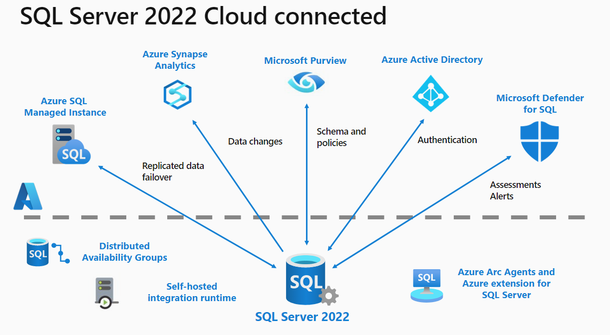

# Workshop: SQL Server 2022 Workshop

#### <i>A Microsoft workshop from the SQL Server team</i>

<h2><b>     Module 02 - SQL Server 2022 Connected to Azure</b></h2>

SQL Server 2022 connects to the cloud with the following Azure services as seen in the following figure:

The SQL Server 2022 engine has been enhanced to integrate with all of these Azure services, but also can require extra software or configuration:

- Distributed Availability Group - Managed disaster recovery using the Link feature for Azure SQL Managed instance requires setting up a Distributed Availability Group. SQL Server Management Studio (SSMS) provides graphical interfaces to assist in this configuration.

- Self-hosted integration runtime - The self-hosted integration runtime is a Windows program that must be installed on your network, separate from the SQL Server 2022 setup experience, to connect to SQL Server for Azure Synapse Link for SQL Server.

- Azure extension for SQL Server - The Azure extension for SQL Server is used to set up the Azure Arc agents and extensions to enable SQL Server 2022 as an Azure Arc-enabled SQL Server. This extension is required to set up Pay-As-You Go Billing, Microsoft Purview, Azure Active Directory (Azure AD) authentication, Microsoft Defender integration, and other Azure Arc services with SQL Server 2022.

You will learn more details about these features in this module:

<dl>

  <dt><a href="#2-0">2.0 Managed Disaster Recovery with Azure SQL Managed Instance</a></dt>
  <dt><a href="#2-1">2.1 Near real-time analytics with Synapse Link for SQL</a></dt>
  <dt><a href="#2-2">2.2 Azure Active Directory (AAD) Authentication</a></dt>
  <dt><a href="#2-3">2.3 Microsoft Purview policy management</a></dt>
  
</dl>

<h2><b><a name="2-0">     2.0 Managed Disaster Recovery with Azure SQL Managed Instance</a></b></h2>

The Link feature for Azure SQL Managed Instance provides a new managed disaster recovery solution for SQL Server 2022.

### Challenges with disaster recovery

Having a diaster recovery site and plan are critical to ensuring your business and application are available at any time. While SQL Server has all the features and capabilities to support various disaster recovery options, a user or admin must do all the configuration, setup, and maintenance.

### Solution using managed disaster recovery in SQL Server 2022

The link feature for Azure SQL Managed Instance allows you to link a SQL Server 2022 database to SQL Managed Instance using built-in Availability Group (AG) technology in SQL Server.

Using documented scripts or graphical wizards with SQL Server Management Studio (SSMS), you can connect an existing AG in SQL Server 2022, or create a new one (no replica required) to create a Distributed Availability Group between SQL Server 2022 and Azure SQL Managed Instance.

Initial data is seeded to create a synchronized database in SQL Managed Instance. Any changes made to the primary SQL Server will now be reflected in the database in SQL Managed Instance.

A planned or forced failover could then be done, should a disaster scenario arise for the application to then use SQL Managed Instance as the primary. SQL Managed Instance offers a compatibility option so that the instance and database are compatible with SQL Server 2022.

This would allow for an offline diaster recovery scenario so that you could restore a copy of the database from SQL Managed Instance *back* to SQL Server 2022.

You can learn more about the Link feature for Azure SQL Managed Instance in the article, [Link feature for Azure SQL Managed Instance](https://aka.ms/milink).

<h2><b><a name="activityiqp">     Exercise: Using the Link feature for Azure SQL Managed Instance </a></b></h2>

Follow the instructions in the readme.md file in the **[sql2022workshop\02_AzureConnected\milinkdr](https://github.com/microsoft/sqlworkshops-sql2022workshop/tree/main/sql2022workshop/02_AzureConnected/milinkdr)** folder.

<h2><b><a name="2-1">     2.1 Near real-time analytics with Synapse Link for SQL</a></b></h2>

Azure Synapse Link for SQL Server allows you to offload read workloads in Azure Synapse for near real-time analytics.

### Challenges with analytics

Azure Synapse has become a popular service for analytics for data of all types. In addition, many customers are looking to offload their read intensive applications from their primary SQL Server to ensure the primary application has plenty of resources. In order to use Azure Synapse for this purpose, you typically have to build Extract Transform Load (ETL) applications, or use scripts to copy data out of SQL Server to synchronize into Azure Synapse. This method can introduce challenges because the data is often out of date in Azure Synapse and it can be costly to build and maintain ETL applications.

### Solution using Synapse Link for near real-time analytics

Azure Synapse Link for SQL Server provides a seamless and tight integration between SQL Server 2022 and Azure Synapse. You can now define a **linked service** for SQL Server in Azure Synapse to set up a connection to SQL Server 2022, including the setup of the self-hosted integration runtime on the network to discover and connect to SQL Server 2022. In addition, you can set up a linked service with an Azure Storage account called the **Landing Zone**.

You can then use Azure Synapse through Azure Synapse Studio or PowerShell to create a **linked connection** using the linked services. This linked connection defines which tables you want to keep synchronized from SQL Server 2022 to Azure Synapse and a **SQL dedicated pool**, which will be the target of the data.

When you start the linked connection, Azure Synapse will coordinate with self-hosted integration runtime to start a synchronization with SQL Server using the specified tables to copy parquet files into the Landing Zone. Azure Synapse will ingest the parquet files from the Landing Zone to create new tables in a SQL dedicated pool with a snapshot of the SQL Server table data.

When committed transactions are made in SQL Server 2022 for affected tables, the SQL Server engine will capture changes automatically with a process called **change feed**, and place files in the Landing Zone to reflect incremental changes. Azure Synapse will pick up these files and make the necessary changes in near real-time to tables in the SQL dedicated pool.

You can now use the power of Azure Synapse with Power BI, Spark, or other analytics to read SQL Server 2022 data in near real-time offloaded from the primary SQL Server database.

You can learn more about Azure Synapse Link for SQL Server in the article, [What is Azure Synapse Link for SQL?](https://aka.ms/synapselinksql)

<h2><b><a name="activityquerystore">     Exercise: Using Synapse Link for SQL Server 2022</a></b></h2>

Follow the instructions in the readme.md file in the **[sql2022workshop\02_AzureConnected\synapselink](https://github.com/microsoft/sqlworkshops-sql2022workshop/tree/main/sql2022workshop/02_AzureConnected/synapselink)** folder.

<h2><b><a name="2-2">     2.2 Azure Active Directory (AAD) Authentication</a></b></h2>

Azure AD provides a cloud-based central authentication authority for any organization using advanced authentication methods. SQL Server 2022 supports logins or users based on Azure AD accounts.

### Challenges with authentication

SQL Server supports authentication for SQL Server or Windows accounts. Many users are looking to centralize their authentication systems using the cloud, and to support advanced authentication methods, like multi-factor authentication (MFA).

### Solution using Azure Active Directory (AAD) for authentication

SQL Server 2022 now supports Azure AD account based logins and users. SQL Server 2022 must be configured as an Azure Arc-enabled SQL Server to use Azure AD. The Azure extension for SQL Server stores information on SQL Server that allows the database engine to authenticate an Azure AD account.

Like Azure SQL Managed Instance and Azure SQL Database, SQL Server 2022 supports a new syntax for `CREATE LOGIN` to support an `EXTERNAL PROVIDER`, which is an Azure AD account (user, group, or service principal). In addition, the `CREATE USER` T-SQL statement supports an `EXTERNAL PROVIDER` with an Azure AD account to provide authentication to users in a database without the need for a login.

One of the benefits of Azure AD is support for advanced authentication methods, such as multi-factor authentication. SQL Server 2022 supports the following Azure AD authentication methods:

- Azure Active Directory Password
- Azure Active Directory Integrated
- Azure Active Directory Universal with Multi-Factor Authentication
- Azure Active Directory access token

You can learn more about SQL Server and Azure AD authentication in the article, [Azure Active Directory authentication for SQL Server](https://aka.ms/aadsqlserver).

<h2><b><a name="activityquerystore">     Exercise: Using Azure Active Directory (AAD) Authentication with SQL Server 2022</a></b></h2>

Follow the instructions in the readme.md file in the **[sql2022workshop\02_AzureConnected\aad](https://github.com/microsoft/sqlworkshops-sql2022workshop/tree/main/sql2022workshop/02_AzureConnected/aad)** folder.

<h2><b><a name="2-3">     2.3 Microsoft Purview policy management</a></b></h2>

Microsoft Purview provides services for central governance by allowing you to create policies for authentication and authorization to SQL Server 2022.

### Challenges with governance

SQL Server provides a rich system to create logins and users for authentication to connect, and roles and permissions for authorization for specific tasks or access to data. One challenge is to integrate the SQL Server security system with other aspects for an organization's security policies, and also to establish SQL Server security policies across multiple SQL Server instances.

### Solution using Microsoft Purview for central governance

Microsoft Purview allows you to create **access policies** against one or more SQL Server 2022 instances. You must have the proper Azure Role-Based Access Control (RBAC) permissions with a Microsoft Purview account to create access policies. An access policy defines specific permissions for an Azure AD account for a SQL Server instance. Access policies include two different types:

- **Data**: A data access policy allows an Azure AD account to log into SQL Server and have access to **read** data from user tables in any database for the instance.

- **DevOps**: A DevOps access policy allows an Azure AD account to log into SQL Server and perform specific tasks, such as **Performance Monitoring** or **Security Auditing**.

You don't need to create a login or user account for the Azure AD account to apply the access policy. SQL Server 2022 must be configured as an Azure Arc-enabled SQL Server to use Microsoft Purview access policies. The Azure extension for SQL Server stores information on SQL Server that allows the database engine to connect to Microsoft Purview to retrieve access policies, cache them inside SQL Server, and apply a policy when an Azure AD account attempts to log into SQL Server.

You can delete the access policy from Microsoft Purview to remove the authentication and authorization of the Azure AD account at any time. You can also apply an access policy across multiple SQL Server 2022 instances, thereby providing a central governance method.

You can learn more about Microsoft Purview access policies for SQL Server 2022 in the article, [Provision access by data owner for SQL Server on Azure Arc-enabled servers](https://aka.ms/purviewsqlaccesspolicies).

<h2><b><a name="activityquerystore">     Exercise: Using Microsoft Purview for access policies to SQL Server 2022</a></b></h2>

Follow the instructions in the readme.md file in the **[sql2022workshop\02_AzureConnected\purview](https://github.com/microsoft/sqlworkshops-sql2022workshop/tree/main/sql2022workshop/02_AzureConnected/purview)** folder.

<h2><b>  Next Steps</b></h2>

Next, Continue to <a href="./03_BuiltinQueryIntelligence.md" target="_blank"><i>Built-in Query Intelligence</i></a>.
