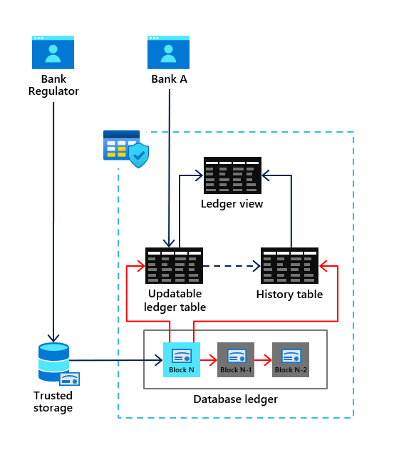

# Workshop: SQL Server 2022 Workshop

#### <i>A Microsoft workshop from the SQL Server team</i>

<h2><b>     SQL Server 2022 Security, Scalability, and Availability</b></h2>

While the Query Store and Intelligent Query Processing are built into the SQL Server engine, SQL Server 2022 continues a tradition of an industry-proven database engine with new capabilities in security, scalability, and availability.

**Watch this video** on the "meat and potatoes" in SQL Server 2022 on Data Exposed:

In this unit you will learn about some of the new major features in the engine. You can refer to https://aka.ms/sqlserver2022 docs to see all 25+ new engine features.

Read through the entire module to learn about all the new core engine capabilities or go directly to the following exercises in this module to see new engine features in action:

<dl>

  <dt><a href="#4-0">4.0 Ledger for SQL Server</a></dt>
  <dt><a href="#4-1">4.1 "Hands-free" tempdb in SQL Server 2022</a></dt>
  <dt><a href="#4-2">4.2 Contained Availability Groups</a></dt>
  
</dl>

You can find demonstrations of other engine improvements for SQL Server 2022 at https://aka.ms/sqlserver2022demos.

____________________________________________________________________________________________________________________________________________________ 

## Security

SQL Server provides rich capabilities to protect your data through authentication, encryption, and authorization. SQL Server 2022 enhances security through several new capabilities including Ledger for SQL Server, new granular fixed server roles, and strict connected encryption.

<h2><b><a name="4-0">     4.0 Tamper evidence proof of data with Ledger for SQL Server</a></b></h2>

Ledger for SQL Server provides built-in tamper evidence proof for data protection through the concept of ledger tables, a database ledger, and digests.

The following figure shows the flow and components for Ledger for SQL Server:

Any table you create as an **updatable ledger table** using the T-SQL CREATE TABLE statement will result in the automatic creation of a **history table** and **ledger view**. All modifications to the ledger table will be recorded in the history table. The ledger view allows you to see all data in the ledger table along with a historical record of changes. Ledger history includes a timestamp of any change, the type of change, and a transaction identifier.

Inside the database are a series of system tables called the **database ledger**. The database ledger includes audit details across all ledger tables of what SQL principal was responsible for the modification and a hash value of the changes with the associated transaction identifier. In addition the database ledger contains a crypto hash in the form of blockchain to verify ledger table data. A database digest can be generated (including the ability to be auto generated and stored by the engine) to be used as an independent verification against the database ledger.

Ledger tables can also be created as append-only. Append-only ledger tables will only allow T-SQL INSERT statements against the table but also are verified with the database ledger and digests.

You can learn more about Ledger for SQL Server at https://aka.ms/sqlledger.

<h2><b><a name="activityiqp">     Exercise: How to use Ledger for SQL Server</a></b></h2>

In this exercise you will go through various aspects of using Ledger for SQL Server for updatable and append-only ledger tables and see verification using digests.

Follow the instructions in the readme.md file in the **[sql2022workshop\04_Engine\sqlledger](https://github.com/microsoft/sqlworkshops-sql2022workshop/tree/main/sql2022workshop/04_Engine/sqlledger)** folder.

### New granular fixed server roles

SQL Server provides fixed server roles to ease the burden of providing permissions for certain server based activities. For example, a SQL principal can be assigned to the **sysadmin** fixed server role which gives the principal the broadest set of permissions possible across the SQL Server instance.

In SQL Server 2022, new fixed server roles have been added that provide more granular permissions for specific tasks. For example, the new fixed server role **##MS_ServerPerformanceStateReader##** allows any member to view key performance metrics through Dynamic Management Views (DMV) but not the same full rights as members of the sysadmin role. New fixed server roles provide the concept of *principle of least privilege*.

You can see all the new fixed server roles at https://learn.microsoft.com/sql/relational-databases/security/authentication-access/server-level-roles#fixed-server-level-roles-introduced-in-sql-server-2022

### Strict connected encryption

SQL Server 2022 provides a more secure method to encrypt connections and communication through a new version of the Tabular Data Stream (TDS) protocol: 8.0. When applications use the new connection string option **encrypt=strict**, TDS 8.0 is used to communicate with SQL Server 2022.

TDS 8.0 provides the following benefits:

- TDS login communication is fully protected under the Transport Layer System (TLS) protocol.
- The latest TLS 1.3 version is now supported.
- Applications must specify a certificate for encryption purposes instead of relying on the TrustServerCertificate option. This requirements can help prevent man-in-the-middle attacks.

You can learn more about strict connected encryption at https://learn.microsoft.com/sql/relational-databases/security/networking/tds-8-and-tls-1-3.

____________________________________________________________________________________________________________________________________________________ 

## Scalability

SQL Server has a proven track record to provide scalability without requiring application changes. SQL Server 2022 continues this tradition including enhancements for memory management, tempdb, and statistics maintenance.

### Buffer pool parallel scan

Operations such as database startup/shutdown, creating a new database, file drop operations, backup/restore operations, Always On failover events, DBCC CHECKDB and DBCC Check Table, log restore operations, and other internal operations (e.g., checkpoint) require a complete scan of all buffers in the buffer pool for SQL Server.

On systems that use a large amount of RAM, for example 1TB or more, scanning the buffer pool for these types of operations can take a significant amount of time, even for small databases.

SQL Server 2022 will by default for systems with a large amount of RAM now use multiple threads to scan the buffer pool in parallel to speed up affected operations.

<h2><b><a name="4-1">     4.1 "Hands-free" tempdb with SQL Server 2022</a></b></h2>

Workloads that run concurrently using temporary tables or table variables can result in performance bottlenecks in the form of PAGELATCH waits on system pages in tempdb. Users often create multiple tempdb data files to help mitigate these types of latch waits. 
In addition, SQL Server 2019 introduced enhancements to further reduce latch concurrency problems with PFS pages built-in and system table pages with tempdb metadata optimization.

SQL Server 2022 closes out remaining page latch waits for tempdb by eliminating latch contention on GAM and SGAM system pages with no application changes or configuration required.

With all of these enhancements, users should be able to use the defaults from SQL Server setup to configure tempdb files and no longer have to perform any other tuning for tempdb system page latch contention.

<h2><b><a name="activityquerystore">     Exercise: See system page latch contention for tempdb eliminated in SQL Server 2022</a></b></h2>

In this exercise you will see how improvements from SQL Server 2019 and SQL Server 2022 have virtually eliminated any system page latch contention in tempdb.

Follow the instructions in the readme.md file in the **[sql2022workshop\04_Engine\tempdb](https://github.com/microsoft/sqlworkshops-sql2022workshop/tree/main/sql2022workshop/04_Engine/tempdb)** folder.

### Auto async update stats concurrency

If asynchronous statistics update is enabled, you can now in SQL Server 2022 use the ASYNC_STATS_UPDATE_WAIT_AT_LOW_PRIORITY database configuration option to cause the background request updating statistics to wait for a Sch-M lock on a low priority queue, to avoid blocking other sessions in high concurrency scenarios.

____________________________________________________________________________________________________________________________________________________ 

## Availability

Ensuring SQL Server is highly available and your data is protected from disasters is important for any business critical application. SQL Server 2022 provides new capabilities for both availability and disaster recovery.

<h2><b><a name="4-2">     4.2 Contained Availability Groups</a></b></h2>

Always On Availability Groups uses replicas to provide the highest level of availability for SQL Server databases. However, only data within the user database is synchronized to secondary replicas. This means that administrators must manually synchronize SQL Server instance objects such as SQL Server Agent jobs, logins, and linked server definitions.

SQL Server 2022 introduces the concept of a *Contained* Availability Group. Now instance level objects are replicated in *contained system databases* in the Availability Group along with user databases. Therefore, on a failover operation instance level objects will be available automatically with no user intervention required.

You can learn more about Contained Availability Groups at https://learn.microsoft.com/sql/database-engine/availability-groups/windows/contained-availability-groups-overview.

<h2><b><a name="activityquerystore">     Exercise: Setup and use Contained Availability Groups</a></b></h2>

In this exercise you will use two SQL Server instances across two machines to see the fundamentals of Contained Availability Groups.

Follow the instructions in the readme.md file in the **[sql2022workshop\04_Engine\containedag](https://github.com/microsoft/sqlworkshops-sql2022workshop/tree/main/sql2022workshop/04_Engine/containedag)** folder.

### Cross-platform snapshot backups

Snapshot backups provide a quick method to backup very large SQL Server databases by avoiding the need to stream SQL Server files into backup file(s). Snapshots have been supported for SQL Server in previous versions but has required a program that uses the Virtual Device Interface (VDI). Windows and SQL Server have provided methods to support snapshot backups using the Volume Snapshot Service (VSS) and the SQL Writer service (which use VDI).

SQL Server 2022 provides built-in support for snapshot backups without VDI using the ALTER DATABASE T-SQL statement option SUSPEND_FOR_SNAPSHOT_BACKUP. When this statement is executed, SQL Server will suspend all I/O on database and transaction log files. Users can then use storage provider snapshot technologies to create a consistent snapshot backup from underlying SQL Server database and transaction log files. Then the backup process is completed by backing up small amount of metadata information into a file. This allows I/O to now continue for database and transaction log files.

Snapshot backups can be restored with the T-SQL RESTORE statement specifying the metadata backup file and all database and transaction log files from the snapshot backup. 

This new method now allows snapshot backups to be performed across both Windows and Linux operating systems without relying on VSS, SQL Writer, or custom VDI applications.

You can learn more about cross-platform snapshot backups at https://learn.microsoft.com/sql/relational-databases/backup-restore/create-a-transact-sql-snapshot-backup.

### Intel QuickAssist backup compression

SQL Server supports options to compress a backup saving in some cases a large amount of space for the target backup file. The process of compression can take a significant amount of CPU cycles for threads within SQL Server that are compressing the backup file.

SQL Server 2022 can use a new compression technique powered by Intel QuickAssist technology (QAT). When a backup is executed using Intel QuickAssist compression, the processing for compression is offloaded to Intel QuickAssist hardware vs core CPUs in the system. This provides more CPU cycles for queries and applications while the backup is being compressed.

You can learn more about how to use Intel QuickAssist Technology (QAT) with SQL Server 2022 at https://learn.microsoft.com/sql/relational-databases/integrated-acceleration/overview.

<h2><b>  Next Steps</b></h2>

Next, Continue to <a href="./05_DataVirt.md" target="_blank"><i>Data Virtualization and Object Storage</i></a>.
