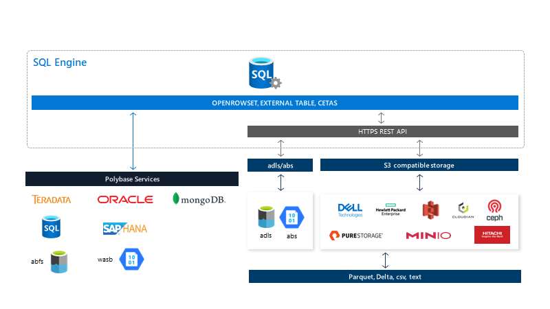

# Workshop: SQL Server 2022 Workshop

#### <i>A Microsoft workshop from the SQL Server team</i>

<h2><b>     SQL Server 2022 Data Virtualization and Object Storage</b></h2>

SQL Server 2022 provides data virtualization capabilities to access data stored in formats such as parquet and delta tables over sources such as Azure Blob Storage, Azure Data Lake Storage, and S3 compatible object storage providers. In addition, SQL Server 2022 enhances remote backup and restore capabilities by supporting S3 compatible object storage providers.

## Data Virtualization in SQL Server

SQL Server has provided since SQL Server 2016 the concept of Polybase, which is accessing data outside of SQL Server using T-SQL statements like **OPENROWSET** and **CREATE EXTERNAL TABLE**. This concept is known as *data virtualization* since users can access data outside of SQL Server without moving the data into SQL Server. SQL Server 2019 added support for data virtualization using ODBC drivers. This data access uses software called Polybase Services. SQL Server 2022 adds support within the database engine using REST API interfaces to access data in Azure Blob Storage, Azure Data Lake Storage, and S3 compatible object storage providers.

The following figure shows the full extent of data virtualization support in SQL Server 2022.

## Data virtualization with REST API connectors

SQL Server 2022 data virtualization now includes access to new data source connectors using REST API interfaces built into the SQL Server engine. These new data source connectors are often used to support a large set of files to build a *data lake*. SQL Server can now be used as a *data hub* to query files in a data lake without moving the data.

### REST API connectors

The following new connectors are supported using REST API:

- Azure Blob Storage

Using the data source connector **abs** you can access files stored in Azure Blob Storage containers. Azure Blob Storage is scalable, highly-available, redundant, cost effective with tiered storage, secured, and optimized for data lakes. You can learn more about data virtualization with Azure Blob Storage at https://learn.microsoft.com/sql/relational-databases/polybase/virtualize-csv.

- Azure Data Lake Storage

Using the data source connector **adls** you can access file stored in Azure Data Lake Storage (ADLS). ADLS is built on top of Azure Blob Storage and provides file system semantics, file-level security, and scale. All these capabilities are built on top of Azure Blob Storage providing low cost, tiered access, high security, high availability, and durability. You can learn more about data virtualization with Azure Data Lake Storage at https://learn.microsoft.com/sql/relational-databases/polybase/virtualize-delta.

- S3 compatible object storage providers

Using the data source connector **s3** you can access file stored in S3 compatible object storage. S3 has become a popular object storage protocol and is supported by many providers both in clouds and on-premises. S3 object storage offers scale, lower cost, geo-distribution, and a reliable data transport. You can read more about data virtualization with S3 compatible object storage providers at https://learn.microsoft.com/sql/relational-databases/polybase/polybase-configure-s3-compatible.

### Using T-SQL for data virtualization

T-SQL provides the following statements to support data virtualization with REST API connectors:

- **OPENROWSET**

The T-SQL statement **OPENROWSET** allows you to access any REST API data connector "ad-hoc" where you supply information about how to connect to the specific data source and file or folder information.

- **CREATE EXTERNAL TABLE**

You can use the T-SQL statement **CREATE EXTERNAL TABLE** to create a "virtual" table that is a mapping to files in any REST API data connector. You can then access the external table just like a SQL Server table except the data is stored in the remote data source. The metadata of the external table is stored in SQL Server system tables.

- **CREATE EXTERNAL TABLE AS SELECT**

A new capability in SQL Server 2022 is to create an external table based on a query from an existing SQL Server table (or another external table) also known as **CREATE EXTERNAL TABLE AS SELECT (CETAS)**. The result of the query will be a new external table and files will be created to the remote data source based on the results of the SELECT statement. You can use this method to export SQL Server data to files in a remote data source.

### New native file format support

SQL Server allows you to create a file format to define the structure of a file in a remote data source. You would use file formats to define the structure of a JSON file since JSON is not a native supported file format. SQL Server 2022 now recognizes native file formats **parquet** and **delta tables**.

- **Parquet**

Parquet is an open-source binary file format with the schema built into the file. Parquet files use a columnar storage format making them efficient for compression and retrieval. You can see an example of how to use parquet files with an S3 compatible object storage provider at https://learn.microsoft.com/sql/relational-databases/polybase/polybase-virtualize-parquet-file.

- **Delta tables**

Delta lake is an open-source storage architecture using delta tables. Delta tables are files based on parquet but also offer basic transaction and log support. You can see an example of how to use Delta tables with Azure Data Lake Storage at https://learn.microsoft.com/sql/relational-databases/polybase/virtualize-delta

## Backup and Restore with S3 compatible object storage providers

SQL Server 2022 extends the **BACKUP TO URL** and **RESTORE FROM URL** T-SQL statements to support S3 compatible object storage providers. Most backup and restore options are available using this new capability. You can learn more about how to use S3 compatible object storage providers for SQL Server backups at https://learn.microsoft.com/sql/relational-databases/backup-restore/sql-server-backup-to-url-s3-compatible-object-storage. 

You can see a list of common S3 compatible object storage providers at https://learn.microsoft.com/sql/relational-databases/backup-restore/sql-server-backup-and-restore-with-s3-compatible-object-storage#providers-of-s3-compatible-object-storage.

<h2><b>     Exercises</b></h2>

Use the following sections in this module for exercises for data virtualization and backup/restore for S3 compatible object storage providers:

<dl>

  <dt><a href="#5-0">5.0 Using OPENROWSET with parquet</a></dt>
  <dt><a href="#5-0">5.1 Using parquet files with S3 compatible object storage</a></dt>
  <dt><a href="#5-1">5.2 Using delta table with S3 compatible object storage</a></dt>
  <dt><a href="#5-2">5.3 Backup and Restore with S3 compatible object storage</a></dt>
  <dt><a href="#5-2">5.4 Using S3 with minio for data virtualization and object storage</a></dt>
  
</dl>

<h2><b><a name="5-0">     5.0 Using parquet files with S3 compatible object storage</a></b></h2>

In this exercise you will learn how to use the T-SQL function OPENROWSET to access parquet files in a public dataset.

<h2><b><a name="activityiqp">     Exercise: Access data from parquet files with OPENROWSET</a></b></h2>

Follow the instructions in the readme.md file in the **[sql2022workshop\05_DataVirt\openrowset](https://github.com/microsoft/sqlworkshops-sql2022workshop/tree/main/sql2022workshop/05_DataVirt/openrowset)** folder.

<h2><b><a name="5-1">     5.1 Using parquet files with S3 compatible object storage provider</a></b></h2>

In this exercise you will see how parquet files can be used with external tables for a S3 compatible object storage provider by reviewing the results of T-SQL notebook.

<h2><b><a name="activityiqp">     Exercise: Access parquet files with T-SQL using S3 compatible object storage</a></b></h2>

Follow the instructions in the readme.md file in the **[sql2022workshop\05_DataVirt\parquet](https://github.com/microsoft/sqlworkshops-sql2022workshop/tree/main/sql2022workshop/05_DataVirt/parquet)** folder.

<h2><b><a name="5-2">     5.2 Using delta table with S3 compatible object storage</a></b></h2>

In this exercise you will see how delta tables can be used with external tables for a S3 compatible object storage provider by reviewing the results of T-SQL notebook.

<h2><b><a name="activityquerystore">     Exercise: Access delta table with T-SQL using S3 compatible object storage</a></b></h2>

Follow the instructions in the readme.md file in the **[sql2022workshop\05_DataVirt\delta](https://github.com/microsoft/sqlworkshops-sql2022workshop/tree/main/sql2022workshop/05_DataVirt/delta)** folder.

<h2><b><a name="5-3">     5.3 Backup and Restore with S3 compatible object storage</a></b></h2>

In this exercise you will see how delta tables Can be used with external tables for a S3 compatible object storage provider by reviewing the results of T-SQL notebook.

<h2><b><a name="activityquerystore">     Exercise: Backup and Restore SQL Server databases using S3 compatible object storage</a></b></h2>

Follow the instructions in the readme.md file in the **[sql2022workshop\05_DataVirt\s3objectstorage](https://github.com/microsoft/sqlworkshops-sql2022workshop/tree/main/sql2022workshop/05_DataVirt/s3objectstorage)** folder.

<h2><b><a name="5-0">     5.4 Using S3 with minio for data virtualization and object storage</a></b></h2>

In this advanced exercise you will setup S3 object storage using a free version of minio server and walk through using parquet files, delta tables, and backup/restore.

<h2><b><a name="activityiqp">     Advanced Exercise: How to use minio for s3 data virtualization and object storage</a></b></h2>

Follow the instructions in the readme.md file in the **[sql2022workshop\05_DataVirt\minio](https://github.com/microsoft/sqlworkshops-sql2022workshop/tree/main/sql2022workshop/05_DataVirt/minio)** folder.

<h2><b>  Next Steps</b></h2>

Next, Continue to <a href="./06_TSQL.md" target="_blank"><i>T-SQL enhancements in SQL Server 2022</i></a>.
